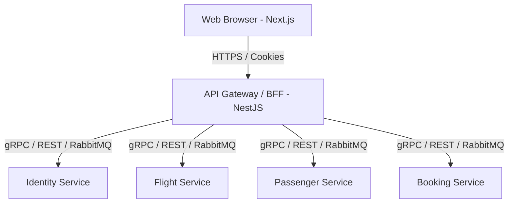

# PRD: Hệ thống Web Frontend & API Gateway (BFF)

## 1. Tổng quan dự án (Overview)
**Mục tiêu:** Xây dựng hệ thống giao diện người dùng (Frontend) hiện đại và chuyên nghiệp cho hệ thống Booking Microservices. Thay vì Frontend gọi trực tiếp tới các microservices (Identity, Flight, Passenger, Booking), chúng ta sẽ áp dụng pattern **Backend-For-Frontend (BFF) / API Gateway** để đảm bảo bảo mật, tối ưu hóa payload, và quản lý xác thực tập trung.

## 2. Phạm vi (Scope)
Dự án được chia thành 2 cấu phần chính:

### 2.1. API Gateway / BFF (NestJS)
- Đóng vai trò là điểm vào duy nhất (Single Point of Entry) cho Web App.
- Tổng hợp dữ liệu từ các services backend (Data Aggregation).
- Quản lý phiên đăng nhập (Session/JWT): Biến đổi JWT token từ Identity service thành **HTTP-Only Cookies** để bảo mật phía trình duyệt.
- Rate limiting, Logging, và Error Handling thống nhất.

### 2.2. Web Frontend (Next.js)
- **Tech Stack:** Next.js (App Router), Tailwind CSS, shadcn/ui, TanStack React Query, Zustand.
- Giao diện người dùng: Rich Aesthetics, Dark Mode, mượt mà và premium.
- Render phía server (SSR) cho SEO và hiệu năng khởi tạo.

## 3. Các luồng người dùng (User Flows)

### 3.1. Luồng Xác thực (Authentication)
- **Đăng ký/Đăng nhập:** Người dùng nhập thông tin.
- **Xử lý:** Gửi request tới BFF. BFF gọi tới `Identity Service` (/api/v1/identity/login).
- **Lưu trữ Token:** Khi `Identity Service` trả về JWT Token, BFF sẽ bọc nó vào **HTTP-Only, Secure Cookie** và trả về trình duyệt (giảm thiểu rủi ro XSS).
- **Đăng xuất:** Xóa Cookie tại BFF.

### 3.2. Luồng Tìm kiếm Chuyến bay (Flight Search)
- **Tìm kiếm:** Chọn sân bay khởi hành, điểm đến, ngày đi.
- **BFF Role:** BFF chuyển tiếp request tới `Flight Service` (/api/v1/flight/search) và có thể map lại schema cho FE dễ render.
- **Hiển thị:** Danh sách các chuyến bay, giá vé, số lượng ghế trống.

### 3.3. Luồng Chọn ghế (Seat Selection)
- **Chi tiết chuyến bay:** Click vào chuyến bay để xem sơ đồ ghế.
- **Chọn ghế:** Gọi tới API lấy thông tin ghế trống/đã đặt (giao tiếp với `Flight Service`).
- **Giữ chỗ (Reserve):** Gửi request chọn ghế, hệ thống tạm lock ghế để người khác không thể đặt trùng.

### 3.4. Luồng Đặt vé & Nhập thông tin (Booking & Passenger)
- **Nhập thông tin:** Tên, số hộ chiếu/CMND (Giao tiếp với `Passenger Service`).
- **Tạo Booking:** Gửi yêu cầu đặt vé. 
- **BFF Role:** BFF có thể orchestration (điều phối) gọi `Passenger Service` để tạo passenger trước, sau đó lấy ID gọi `Booking Service` để tạo vé, hoặc bản thân Backend Microservices đã có saga/orchestrator thì BFF chỉ việc gọi đúng 1 endpoint gateway.
- **Thanh toán / Xác nhận:** Hiển thị trạng thái đặt vé thành công.

### 3.5. Luồng Quản lý (Dashboard)
- Hiển thị danh sách vé đã đặt (Booking Service).
- Xem trạng thái chuyến bay, lịch sử giao dịch.

## 4. Kiến trúc hệ thống dự kiến (Architecture Proposal)

## 5. Non-functional Requirements (NFRs)
- **Security:** Chống CSRF (nếu dùng cookie auth), XSS. Ẩn toàn bộ Access Token khỏi Javascript.
- **UI/UX:** Load mượt, có skeleton loading, Micro-animations, responsive trên Mobile/Tablet.
- **SEO:** Các trang public (Search, Trang chủ) cần tối ưu thẻ meta. Trang private (Dashboard) client-side data fetching với React Query.

## 6. Milestones (Kế hoạch thực hiện)
- **Giai đoạn 1:** Setup Monorepo/Cấu trúc dự án (BFF + Frontend).
- **Giai đoạn 2:** Phát triển hệ thống Auth (Identity integration).
- **Giai đoạn 3:** Xây dựng tính năng Search & View Flight.
- **Giai đoạn 4:** Xây dựng tính năng Booking & Quản lý Passenger.
- **Giai đoạn 5:** Hoàn thiện UI/UX, audit & E2E Testing.
